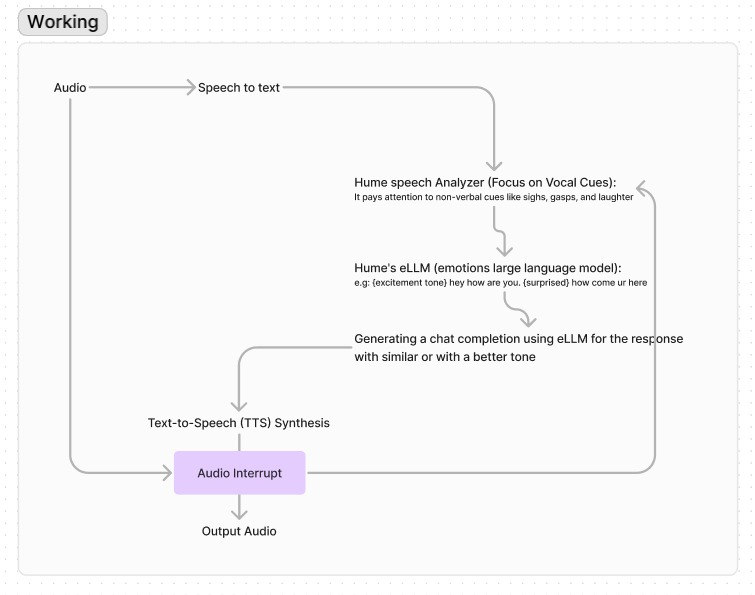

# BAYMAX (conversational companion Chatbot) 

This project presents a conversational chatbot with an intuitive graphical user interface (GUI) built using PyQt5. The chatbot engages users in dynamic and friendly conversations, leveraging the powerful Hume AI  for generating contextually relevant responses.

**Understanding Emotions:** Hume's eLLM goes beyond just words. It analyzes things like tone of voice, pitch, and even pauses in your speech to identify emotions. It claims to recognize a wide range, including anger, amusement, and even boredom.

**Focus on Vocal Cues:** Hume recognizes that emotions go beyond words. It pays attention to non-verbal cues like sighs, gasps, and laughter, which it calls "vocal bursts" to understand how you're really feeling.

**Adapting to You:** Hume is constantly learning and improving. By analyzing your interactions and preferences, it tailors its responses to better suit your emotional state.

**Mirroring and Responding:** Hume can not only identify your emotions but also respond in a similar tone. This can make conversations feel more natural and engaging.

## Key Features:

- **✨ Transcription, language modeling, and expressive TTS**
- **🗣 High-quality voice with human-like variation in pitch and tone**
- **💬 Interruptibility and end-of-turn detection**
- **🫶Empathic expression understanding and language generation**
- **⌨System prompt: to alter personality, response style, and the content of speech**

## Requirements:

- Python 3.7 or above
- EllEvenlabs for STT
- Hume Python SDK

## Problem Statment 
1. **Lack of Personalization**: The chatbot may struggle to provide personalized responses tailored to the user's preferences, leading to a generic and less engaging interaction.

2. **Limited Context Understanding**: Understanding the context of conversations can be challenging for chatbots, leading to misunderstandings or irrelevant responses.

3. **Emotional Intelligence**: Chatbots may lack emotional intelligence, making it difficult for them to understand and appropriately respond to the user's emotions, especially in sensitive situations.

4. **Maintaining Engagement**: Keeping users engaged over time can be difficult, as chatbots may struggle to provide fresh and interesting content or maintain continuity in conversations.

5. **Handling Complex Queries**: Chatbots may struggle to handle complex queries or tasks that require deep understanding or problem-solving skills beyond their programmed capabilities.

## Getting Started:

### SystemFlowchart 

**Methodology**:

This project employed a combination of software development practices and methodologies to build a robust and user-friendly conversational companion chatbot. The key steps involved:

**1. Requirement Gathering and Analysis:**

• Identified user needs and requirements for a personalized chatbot, focusing on assistance in various aspects of daily life.

• Defined functionalities such as personalized interactions, comprehensive assistance, continuous learning, and an engaging user experience.

**2. Design and Architecture:**

• Flowchart Development: Created a detailed flowchart outlining the logic and workflow of the chatbot application, including user interaction, NLP processing, and response generation.

• Python Flask Framework: Implemented the chatbot using the Flask web framework for its lightweight and efficient nature, suitable for building web applications.

• Hume Voice API Integration: Integrated the Hume voice synthesis API to create distinct and personalized vocal identities, enabling the chatbot to interact with users through a unique and recognizable voice

**3. Implementation and Development:**

• Machine Learning (ML): Employed machine learning models, particularly the GPT (Generative Pre-trained Transformer) architecture, for generating natural and contextually appropriate responses, allowing the chatbot to continuously learn from user interactions. Using ELLM Emotion Larger Language model

• User Interface (UI): Built a user-friendly GUI using Flask's templating capabilities, providing a seamless experience for managing personality configurations, engaging in conversations, and accessing different functionalities.

• Testing and Debugging: Implemented a comprehensive test suite using the unit test framework to ensure the functionality and accuracy of the chatbot application. This involved creating unit tests, integration tests, and end-to-end tests to cover various aspects of the software.

**4. Deployment and Maintenance:**

• Docker Containerization: Created a Docker image to package the chatbot application along with its dependencies, facilitating easy deployment and ensuring consistent performance across different environments.

• Deployment to Docker Hub: Pushed the Docker image to Docker Hub, a public registry for Docker images, allowing for easy sharing and distribution of the chatbot.

**5. Evaluation and Refinement:**

• Performance Monitoring: Monitored the chatbot's performance metrics, such as response time, accuracy, and user engagement, to identify areas for optimization and improvement.

• Ongoing Research and Development: Stayed abreast of advancements in NLP, ML, and chatbot technologies to continuously enhance the chatbot's capabilities and user experience.

**Operations:**

Docker is an open-source platform designed to automate the deployment, scaling, and management of applications using containerization. Containers encapsulate an application and all its dependencies, ensuring it runs reliably.

1.  *Images*: A Docker image is a lightweight, standalone, and executable software package that includes everything needed to run a piece of software, including the code, runtime, libraries, environment variables, and configuration files.
    
2.  *Containers*: Containers are instances of Docker images that run applications. They are isolated from each other and the host system, ensuring that the application runs in a consistent environment.
    
3.  *Dockerfile*: This is a text file containing instructions on how to build a Docker image. It includes commands to install dependencies, copy files, and define entry points.
    
4.  *Docker Hub*: A cloud-based repository where Docker users can store and share Docker images.
    

#### Benefits of Using Docker for Your Conversational Companion Chatbot Project

1.  *Isolation*: Docker containers run in isolation from one another and the host system. This isolation ensures that dependencies and configurations in one container do not affect others, providing a stable and predictable environment for your chatbot application.
    
2.  *Portability*: Containers encapsulate everything your application needs to run, making it easy to move between different environments (development, testing, production) and different platforms (local machines, cloud servers). If Docker is installed, the container will run identically everywhere.
    
3.  *Efficiency*: Docker containers are lightweight compared to traditional virtual machines because they share the host system's operating system kernel. This results in lower overhead and better performance, allowing you to run more containers on the same hardware.
    
4.  *Consistency*: By packaging your application and its dependencies into a single image, Docker ensures that your application will behave the same in any environment, reducing the "it works on my machine" problem.
    
5.  *Scalability*: Docker makes it easy to scale your application by running multiple instances of containers. Tools like Docker Compose and Kubernetes can orchestrate container deployment, scaling, and management.
    
6.  *Version Control*: Docker images can be versioned, making it easy to track changes, roll back to previous versions, and manage different versions of your application.
    

#### Contribution of Docker in our project

1.  *Development and Testing*: You can create a consistent development environment for your chatbot, making it easy for team members to collaborate and test new features without worrying about environment discrepancies.
    
2.  *Deployment*: Docker allows for smooth deployment of your chatbot on various platforms (e.g., cloud providers, on-premises servers). You can create a CI/CD pipeline to automate the build and deployment process, ensuring rapid and reliable updates.
    
3.  *Customization*: With Docker, you have fine-grained control over the deployment environment. You can customize the container to meet the specific needs of your chatbot, such as optimizing performance, configuring environment variables, and managing dependencies.
    
4.  *Microservices Architecture*: If your chatbot project involves multiple services (e.g., NLP processing, database, front-end), Docker can help you manage and orchestrate these services effectively. Each service can run in its own container, enabling independent scaling and deployment.

**Testing**

**Test cases**
import os
import pytest
from flask import jsonify
from flask_socketio import SocketIOTestClient
from flask.testing import FlaskClient
from app import app, socketio, display_configs, create_personality_config, delete_personality_config, hume_api_key

@pytest.fixture
def client():
    app.config['TESTING'] = True
    with app.test_client() as client:
        yield client

@pytest.fixture
def socket_client():
    with socketio.test_client(app) as client:
        yield client

def test_check_status(client):
    response = client.get('/check_status')
    assert response.status_code == 200
    assert response.json == {'running': True}

def test_stop_chat(client):
    response = client.post('/stop_chat')
    assert response.status_code == 200
    assert response.json == {'success': True}

def test_index_get(client):
    response = client.get('/')
    assert response.status_code == 200
    assert b'Choose Personality Configuration' in response.data

def test_create_personality_config():
    name = "Test Personality"
    prompt = "This is a test prompt."
    config_id = create_personality_config(name, prompt)
    assert isinstance(config_id, str)

def test_delete_personality_config():
    # Create a config first to ensure one exists
    name = "Test Delete"
    prompt = "This is a test delete prompt."
    config_id = create_personality_config(name, prompt)
    
    # Delete the created config
    delete_personality_config(config_id)
    
    # Ensure the config is deleted (assuming display_configs won't list it anymore)
    configs = display_configs()
    assert all(config[1] != config_id for config in configs)

def test_handle_chat_message(socket_client):
    test_message = 'Hello, Baymax!'
    socket_client.emit('chat_message', test_message)
    received = socket_client.get_received()
    assert len(received) == 1
    assert received[0]['name'] == 'chat_message'
    assert received[0]['args'][0] == test_message

def test_index_post_activate_chat(client, monkeypatch):
    data = {'choice': '1'}
    monkeypatch.setattr('builtins.input', lambda _: '6aa1a7ca-d3d0-4ea9-9e7d-97b064e7c109')
    response = client.post('/', json=data)
    assert response.status_code == 200
    assert response.json == {'success': True}

def test_index_post_display_configs(client):
    data = {'choice': '2'}
    response = client.post('/', json=data)
    assert response.status_code == 200
    assert response.json == {'success': True}

def test_index_post_create_personality(client):
    data = {
        'choice': '3',
        'personalityName': 'Test Personality',
        'personalityDescription': 'This is a test description.'
    }
    response = client.post('/', json=data)
    assert response.status_code == 200
    assert response.json['success'] == True
    assert 'config_id' in response.json

def test_index_post_delete_personality(client):
    # Create a config first to ensure one exists
    name = "Test Delete"
    prompt = "This is a test delete prompt."
    config_id = create_personality_config(name, prompt)
    
    data = {
        'choice': '4',
        'deleteConfig': config_id
    }
    response = client.post('/', json=data)
    assert response.status_code == 200
    assert response.json['success'] == True

**Testing results**

    

## Credits:

- This project utilizes the Hume eLLM for advanced emotional natural language processing.

## License:

Working on the LICENSE...

This project will be licensed under the [MIT License](LICENSE). 
