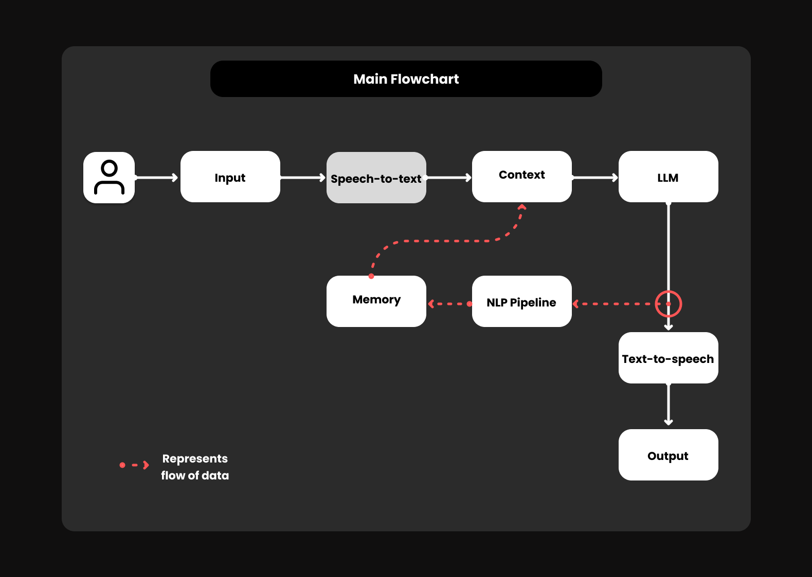
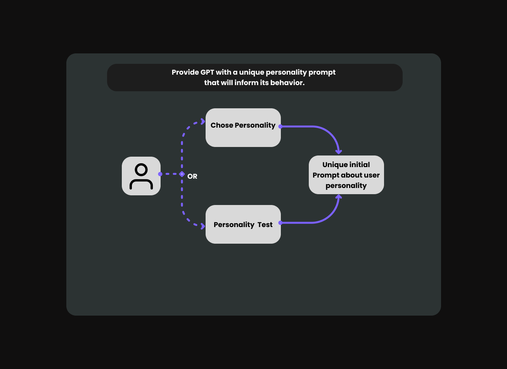
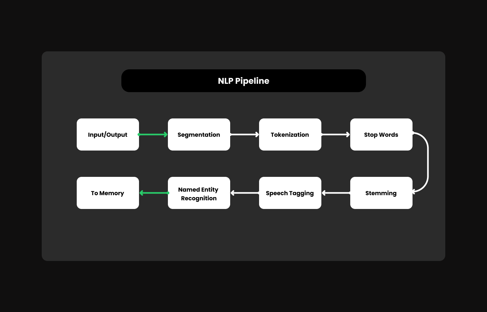
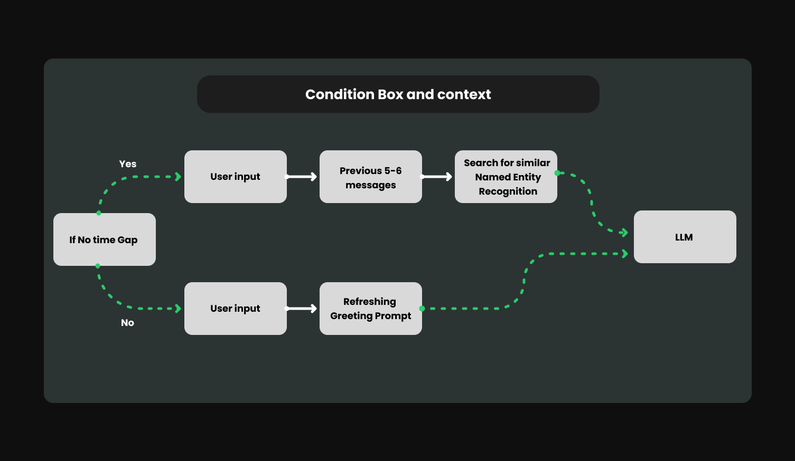
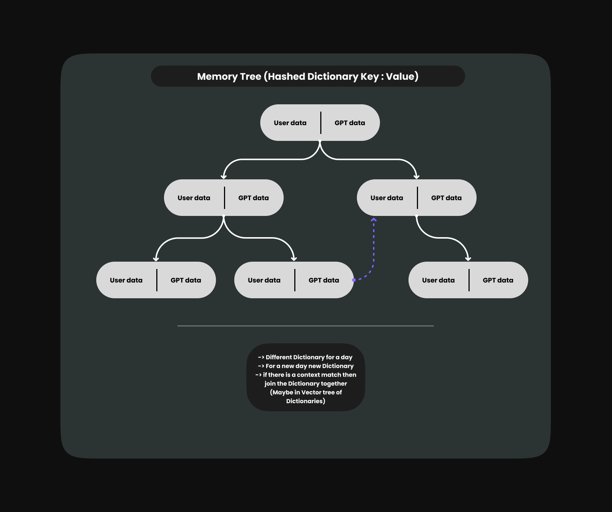

# BYMAX (conversational companion Chatbot) 

This project presents a conversational chatbot with an intuitive graphical user interface (GUI) built using PyQt5. The chatbot engages users in dynamic and friendly conversations, leveraging the powerful OpenAI GPT-3.5 Turbo model for generating contextually relevant responses. Additionally, the application offers seamless conversation history management, allowing users to revisit and review past interactions.

## Key Features:

- **Interactive GUI**: Enjoy a user-friendly interface for effortless communication with the chatbot.
- **Advanced AI Capabilities**: Harness the intelligence of the OpenAI GPT-3.5 Turbo model for generating natural and contextually appropriate responses.
- **Conversation History**: Seamlessly track and manage conversation history, facilitating continuity and context-aware dialogue.
- **Multithreading Support**: Experience smooth and responsive interactions with asynchronous message handling.

## Requirements:

- Python 3.7 or above
- EllEvenlabs for STT
- OpenAI Python library

## Problem Statment 
1. **Lack of Personalization**: The chatbot may struggle to provide personalized responses tailored to the user's preferences, leading to a generic and less engaging interaction.

2. **Limited Context Understanding**: Understanding the context of conversations can be challenging for chatbots, leading to misunderstandings or irrelevant responses.

3. **Emotional Intelligence**: Chatbots may lack emotional intelligence, making it difficult for them to understand and appropriately respond to the user's emotions, especially in sensitive situations.

4. **Maintaining Engagement**: Keeping users engaged over time can be difficult, as chatbots may struggle to provide fresh and interesting content or maintain continuity in conversations.

5. **Handling Complex Queries**: Chatbots may struggle to handle complex queries or tasks that require deep understanding or problem-solving skills beyond their programmed capabilities.

## Getting Started:

### SystemFlowchart 

- **Input:** This is the starting point of the flowchart, where the speech is captured through a microphone or any other recording device.

- **Speech-to-Text:** The captured speech is converted into text format by an automatic speech recognition (ASR) system.

- **Context:** This block refers to additional information or related text that can be used to improve the accuracy of the speech recognition process.

- **LLM:** Large language model (LLM) is a type of artificial intelligence (AI) that’s trained on a massive amount of text data. It can be used to improve the accuracy of speech recognition and can also be used for other purposes, such as generating different creative text formats, translating languages, writing different kinds of creative content, and answering your questions in an informative way.

- **Memory:** This block stores information that can be used to improve the accuracy of the speech recognition process.

- **NLP Pipeline:** Natural language processing (NLP) pipeline is a sequence of algorithms that are applied to text to understand its meaning and structure. It can be used to improve the accuracy of speech recognition and to prepare the text for text-to-speech conversion.

- **Text-to-Speech:** The converted text is transformed back into speech using a text-to-speech (TTS) system.

- **Output:** This is the final stage of the flowchart, where the converted speech is delivered through a speaker or any other audio playback device.

### Choosing personality

### NLP Pipeline

- **Input/Output:** This represents the beginning and the end of the NLP pipeline. Text data is fed into the system as input, and processed text data is outputted at the end.

- **Segmentation:** The input text is divided into meaningful units. This could involve splitting sentences into words or words into morphemes (the smallest meaningful unit of a word).

- **Tokenization:** In this stage, the segments are categorized into different classes or tokens, such as nouns, verbs, adjectives, and punctuation.

- **Stop Words:** Certain words, such as “the,” “a,” “an,” “in,” “on,” are filtered out because they don't contribute much meaning to the text.

- **Named Entity Recognition (NER):** This stage identifies and classifies named entities in the text, such as people, organizations, locations, medical codes, time expressions, quantities, monetary values, percentages, etc.

- **Speech Tagging:** Each word in the text is assigned a part-of-speech (POS) tag, such as noun, verb, adjective, adverb, preposition, etc. This helps to understand the grammatical structure of the text.

- **Stemming:** This process reduces inflected words to their base or root form. For instance, the words "running," "runs," and "ran" would all be stemmed to "run."

- **Lemmatization:** Similar to stemming, but lemmatization takes the process a step further by considering the context of the word to determine the appropriate base or root form. For example, "better" would be lemmatized to "good" because "good" is the base form considering the context, whereas stemming would reduce it to "bet."

### Logic for context to behave similar to Human

- **Condition Box and Context:** This section likely refers to the current conversation and factors such as the intent of the user's query and the history of the conversation.

 **1. Yes - User Input:** This initial decision point indicates that if the conversation is new or the user has recently provided input, the system progresses to the next step.

 **2. Previous 5-6 Messages & Named Entity Recognition (NER):** If there has not been recent user input, the system analyzes the past 5-6 messages to identify named entities like people, places, or organizations mentioned in the conversation.

 **3. Search for Similar Messages:** Based on the identified named entities and the conversation history, the system searches for similar conversations to retrieve relevant responses.

- **No Time Gap:** This decision point indicates that there has not been a significant gap between the current turn and the last user input.

 **1. User Input & Greeting Prompt:** If there has not been a significant time gap, the system prompts the user for new input using a greeting message.

 **2. No:** This decision point indicates that there has been a significant time gap since the last user input.

- **Refreshing Greeting Prompt:** If there has been a significant time gap, the system refreshes the conversation with a greeting message.

### Memory Tree ideology

- **Start:** This is the starting point of the flowchart.

- **User data & GPT data:** These two boxes represent the data streams used in the system. User data refers to the speech input from the user, and GPT data likely refers to the output generated by a large language model like GPT-3, which is trained on a massive amount of text data and can be used for various purposes like generating different creative text formats, translating languages, writing different kinds of creative content, and answering questions in an informative way.

- **Merge data:** Here, the user data and GPT data are merged or combined.

- **Dictionary:** This block stores information about previously encountered conversations, potentially to improve the accuracy of future speech recognition.

- **Update dictionary:** The merged data is used to update the dictionary.

- **Context Match:** This decision point checks if there is a context match between the current conversation and entries in the dictionary.

  - **Yes:** If there is a context match, the system proceeds to the next step.

  - **No:** If there is no context match, the system proceeds to the next step.

- **Join Dictionary:** The matching entries from the dictionary are merged or combined.

- **Maybe in Vector tree of Dictionaries:** This section suggests that the merged dictionary entries might be stored in a data structure called a vector tree. Vector trees are a type of search tree that can efficiently store and retrieve similar data items.

- **New Dictionary for the Day:** A new dictionary is created for the current day.

## Credits:

- This project utilizes the OpenAI GPT-3.5 Turbo model for advanced natural language processing.

## License:

This project is licensed under the [MIT License](LICENSE).
